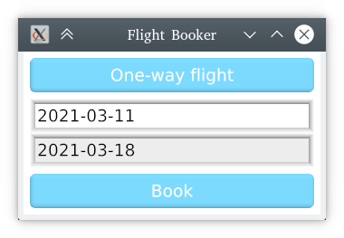

KAS 7GUIs
==========

[7GUIs](https://eugenkiss.github.io/7guis/) is a GUI programming benchmark.
This repository implements the benchmark's tasks via the [KAS] GUI.

[KAS]: https://github.com/kas-gui/kas

Installation and dependencies
----------------

Currently, KAS's only drawing method is [WebGPU](https://github.com/gfx-rs/wgpu-rs),
which requires DirectX 11/12, Vulkan or Metal.
In the future, there may be support for OpenGL and software rendering.

If you haven't already, install [Rust](https://www.rust-lang.org/), including
the *nightly* channel (`rustup toolchain install nightly`). Either make nightly
the default (`rustup default nightly`) or use `cargo +nightly ...` below.

A few other dependencies may require installation, depending on the system.
On Ubuntu:

```sh
sudo apt-get install build-essential git python3 cmake libxcb-shape0-dev libxcb-xfixes0-dev
```

Next, clone the repository:

```
git clone https://github.com/kas-gui/7guis
cd 7guis
cargo run
```

Tasks
----

A brief list of the implemented tasks:

### Counter

A very simple push-button application.


### Temperature Converter

An application to convert between Celsius and Fahrenheit temperatures.


### Flight booker

An application to gather date inputs, with real-time validation of input fields.



### Timer

A timer with animations and slightly-complex event handling.


### CRUD

A simple front-end to a shared data-set supporting Create, Read, Update and
Delete operations as well as filtering.


### Circle drawer

An app for drawing circles with unified undo handling.

Not implemented yet. At the time of writing, KAS lacks context menus and
universal "undo" support (the drawing API is also a bit primitive, though
still sufficient for this example).

### Cells

A simple spreadsheet application.

Not implemented yet. At the time of writing, KAS lacks a table / grid-data view
(this is just a slightly more complex variant of the `ListView` widget used in
the CRUD example). Also requires change-propegation code to update cells, but
this is not related to GUI code (the widgets should simply be a view over the
dataset and not responsible for change propegation).


Copyright and Licence
-------

This collection of examples is distributed under the "New BSD License".
See the COPYRIGHT file for details.
